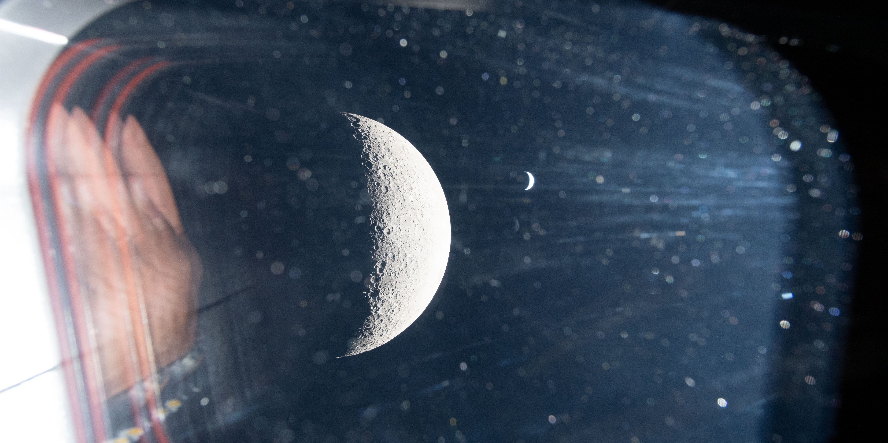

<div align="center">
  <pre>
██╗  ██╗██╗                                                                                 
██║  ██║██║                                                                                 
███████║██║                                                                                 
██╔══██║██║                                                                                 
██║  ██║██║▄█╗                                                                              
╚═╝  ╚═╝╚═╝╚═╝                                                                              
                                                                                            
██╗███╗   ███╗    ███████╗ █████╗ ██╗   ██╗██████╗ ██╗  ██╗ █████╗  ██████╗██╗   ██╗ █████╗ 
██║████╗ ████║    ██╔════╝██╔══██╗██║   ██║██╔══██╗██║  ██║██╔══██╗██╔════╝╚██╗ ██╔╝██╔══██╗
██║██╔████╔██║    ███████╗███████║██║   ██║██████╔╝███████║███████║██║  ███╗╚████╔╝ ███████║
██║██║╚██╔╝██║    ╚════██║██╔══██║██║   ██║██╔══██╗██╔══██║██╔══██║██║   ██║ ╚██╔╝  ██╔══██║
██║██║ ╚═╝ ██║    ███████║██║  ██║╚██████╔╝██████╔╝██║  ██║██║  ██║╚██████╔╝  ██║   ██║  ██║
╚═╝╚═╝     ╚═╝    ╚══════╝╚═╝  ╚═╝ ╚═════╝ ╚═════╝ ╚═╝  ╚═╝╚═╝  ╚═╝ ╚═════╝   ╚═╝   ╚═╝  ╚═╝
                                                                                           
  </pre>

<!-- Typing animation -->
[](https://git.io/typing-svg)

<br/>

<!-- Social badges -->
[](https://www.instagram.com/saubhagya.prasad/)
[](https://simple-portfolio-jet-omega.vercel.app)
[](mailto:work.sprasad7@gmail.com)
[](https://en.wikipedia.org/wiki/India)

</div>

---


<!-- About + Terminal -->
<table>
<tr>
<td width="55%" valign="top">

## 👾 About Me

```bash
rowin-C@github ~ % cat about-me.ts
 
  ┌─────────────────────────────────────────────────────────────┐
  │                                                             │
  │   - Info ──────────────────────────────────────────────     │
  │   . Name:      ............  Saubhagya Prasad               │
  │   . Alias:     ............  rowin-C                        │
  │   . Role:      ............  Software Developer @ Aniworks  │
  │   . Location:  ............  India 🇮🇳                       │
  │   . Degree:    ............  B.Tech CS, IIITDM Kancheepuram │
  │                                                             │
  │   - Stack ──────────────────────────────────────────────    │
  │   . Frontend:  ............  React, Next.js, TypeScript     │
  │   . Styling:   ............  Tailwind CSS, shadcn/ui        │
  │   . Auth:      ............  OAuth 2.0 (Google, Microsoft)  │
  │   . Tools:     ............  Git, Neovim, WSL2, Vercel      │
  │                                                             │
  │   - Hobbies ────────────────────────────────────────────    │
  │   . Hobbies.Cinema:   ......  Movies & IMAX nerd 🎬         │
  │   . Hobbies.Space:    ......  Interstellar stuff 🚀         │
  │   . Hobbies.Creative: ......  Blender, 3D Art, Thumbnails   │
  │   . Hobbies.Music:    ......  Guitar (Electric & Acoustic)  │
  │                                                             │
  │   - GitHub ─────────────────────────────────────────────    │
  │   . Repos:     .............  35+                           │
  │   . Status:    .............  Open to opportunities ✦      │
  │                                                             │
  └─────────────────────────────────────────────────────────────┘
 
rowin-C@github ~ % _
` ` `
```

</td>
<td width="45%" valign="top">

## 📊 GitHub Stats


[](https://github.com/rowin-C)

</td>
</tr>
<tr>
<td colspan="2">

My name is Saubhagya, and I'm a self-taught developer from West Bengal, India. I began my software development journey in 2020, in the first year of college making simple portfolio pages and getting into programming. B.Tech CS grad from **IIITDM Kancheepuram** with production experience shipping awesome websites, secure email, and real-time video features at **Aniworks**.

</td>
</tr>
</table>

---


## 🚀 Live Projects

<div align="center">

| # | Project | Description | Stack | Link |
|---|---------|-------------|-------|------|
| 🥇 | **e-Patra** | Next-gen secure email suite with E2E encryption & unlimited storage — built at Aniworks | Next.js · TypeScript · Encryption | [e-patra.com](https://e-patra.com/) |
| 🥈 | **Portfolio v2** | Personal developer portfolio — clean, fast, and responsive | Next.js · Tailwind · Vercel | [Live ↗](https://portfolio-chi-five-17.vercel.app/) |
| 🥉 | **Sudobox** | Software dev agency site offering full-stack & digital marketing services | Next.js · React | [Live ↗](https://sudobox.vercel.app/) |
| 04 | **dotGlobal** | Digital agency landing page — fast, modern, results-driven | Astro · Vercel | [Live ↗](https://dotglobal.vercel.app/) |
| 05 | **geekTechie.** | Tech blog covering programming, tutorials & developer life | Next.js · Sanity CMS | [Live ↗](https://blog-nextjs-sanity-mauve-nu.vercel.app/) |

</div>

> 🟢 All projects are live and deployed.

---

## ⚙️ Tech Stack

<div align="center">

<!-- Frontend -->


<!-- Backend & Tools -->


<!-- Creative -->


</div>

---

## 📦 Repositories

<table width="100%" align="center">
<tr>
<td width="50%" valign="top">

[](https://github.com/rowin-C/AI-pdf-cleaner-local-LLM)

</td>
<td width="50%" valign="top">

[](https://github.com/rowin-C/my-pgp-demo)

</td>
</tr>
<tr>
<td width="50%" valign="top">

[](https://github.com/rowin-C/Unity_2D_platformer)

</td>
<td width="50%" valign="top">

[](https://github.com/rowin-C/Machine_learning_Invoicing_system)

</td>
</tr>
</table>

<div align="center">

[](https://github.com/rowin-C?tab=repositories)

</div>


---

## 📈 Contribution Graph

<div align="center">


</div>


---

<p align="center">
  
</p>

<div style="
  background: #04080f;
  color: #c8d8e8;
  font-family: 'Georgia', serif;
  text-align: center;
  padding: 28px 24px 32px;
  border-top: 1px solid #1a2a3a;
">
  <!-- Credit line -->
  <p style="
    font-size: 11px;
    letter-spacing: 0.12em;
    text-transform: uppercase;
    color: #5a7a9a;
    margin: 0 0 20px;
  ">
    📷 Image Credit: NASA / Artemis II Mission 2026</em>
  </p>

  <!-- Divider -->
  <div style="
    width: 40px;
    height: 1px;
    background: #2a4a6a;
    margin: 0 auto 20px;
  "></div>

</div>

<div align="center">

<!-- Quote -->
> *"Shoot for the moon. Even if you miss, you'll land among the stars."*
> — Norman Vincent Peale

<br/>

<!-- Footer wave -->
[](https://github.com/rowin-C)


</div>

